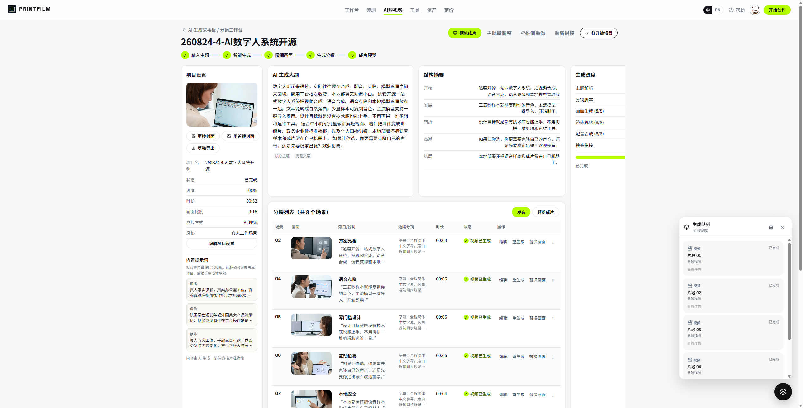
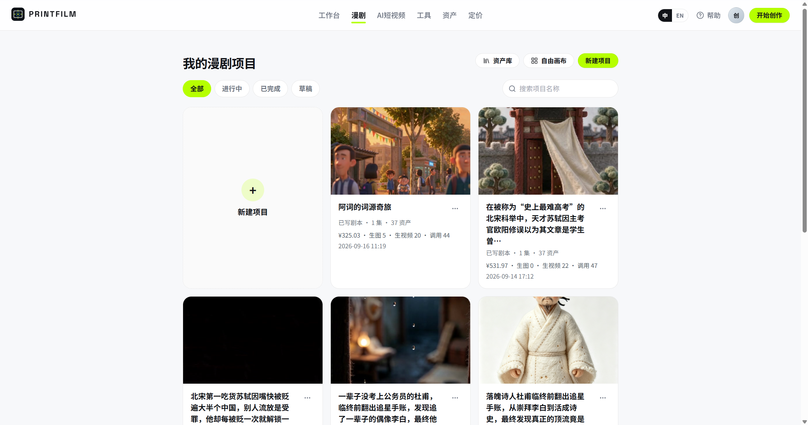
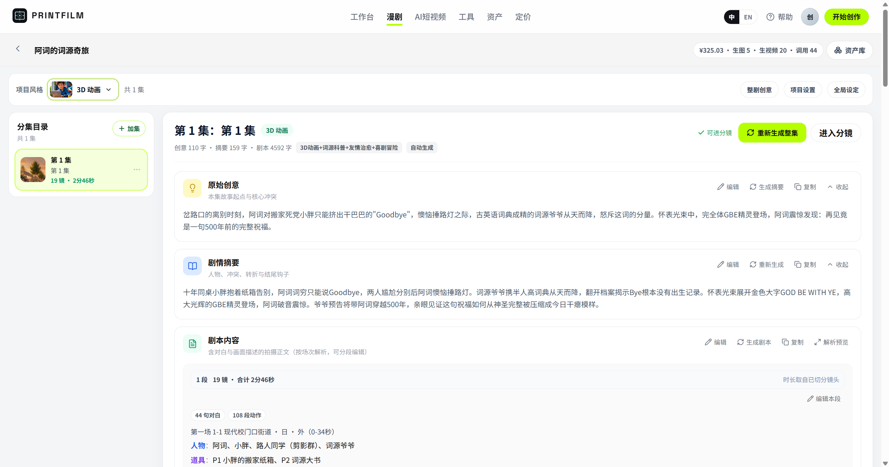
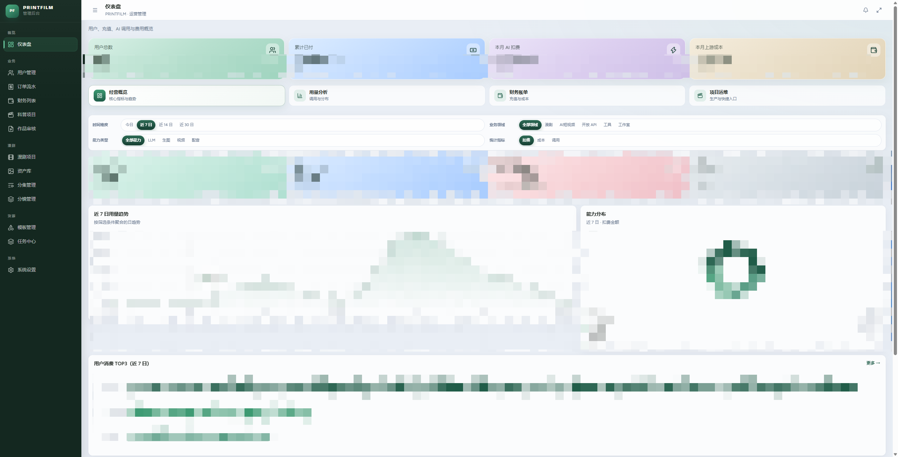

# PRINTFILM

**开源项目**：PRINTFILM  
**版本**：0.2.0 | **更新**：2026-09-17

模板驱动的 AI 短视频与漫剧创作平台：主题 / 剧本 → 分镜 → 生图 → 生视频 → 成片。口播由 Seedance 在出片时一并生成，无需单独配音。同一条生成能力，多套视觉风格；支持注册登录、按量计费、管理后台与开放 API。


| 层级 | 技术选型 |
|------|----------|
| 后端 | Python 3.12 · FastAPI · SQLAlchemy · PostgreSQL |
| 用户端 | React 19 · TypeScript · Vite 8 |
| 管理端 | React 19 · Tailwind · shadcn/ui |
| AI | 文字 / 生图 / 生视频：直接对接 OpenAI + BytePlus ModelArk（Seedance 视频自带口播；见 [docs/PROVIDERS.md](docs/PROVIDERS.md)） |
| 任务 | 应用内 scheduler + executor + poller（随 FastAPI 进程启动） |
| 部署 | Docker 全栈镜像，或本机三个进程 + Postgres/Redis 容器 |

---

## 目录

- [快速开始](#快速开始)
- [Docker 部署](#docker-部署)
- [AI 服务配置](#ai-服务配置)
- [操作手册](#操作手册)
  - [1. 系统概述](#1-系统概述)
  - [2. 环境要求](#2-环境要求)
  - [3. 安装与启动](#3-安装与启动)
  - [4. 登录与账号](#4-登录与账号)
  - [5. 界面与模块导航](#5-界面与模块导航)
  - [6. 业务模块操作指南](#6-业务模块操作指南)
  - [7. 典型业务流程](#7-典型业务流程)
  - [8. 系统管理](#8-系统管理)
  - [9. 日常运维](#9-日常运维)
  - [10. 常见问题与排查](#10-常见问题与排查)
  - [11. 附录](#11-附录)
- [贡献](#贡献)
- [开源许可](#开源许可)

---

## 快速开始

推荐用预构建镜像，本机只需 Docker。`gcc` 命名空间公开，**拉取无需登录**。

```bash
git clone https://github.com/UNIAI-TEAM/cineai.git
cd cineai

cp deploy/.env.docker.example deploy/.env.docker
# 请把 POSTGRES_PASSWORD、SECRET_KEY 改成自己的值
# 填入 OpenAI API Key（OPENAI_API_KEY）与 BytePlus ModelArk API Key（ARK_API_KEY，两者是不同上游）

docker compose --env-file deploy/.env.docker up -d
```

| 服务 | 地址 |
|------|------|
| 用户端 | http://localhost:8080 |
| 管理后台 | http://localhost:8081 |
| API | http://localhost:8000 |
| OpenAPI | http://localhost:8000/docs |
| 健康检查 | http://localhost:8000/api/health |

| 角色 | 如何获得 |
|------|----------|
| 普通用户 | 打开用户端 `/auth` 自行注册（邮箱 + 密码） |
| 管理员 | 先注册，再在 `deploy/.env.docker` 写 `ADMIN_BOOTSTRAP_EMAILS=你的邮箱`，执行 `docker compose --env-file deploy/.env.docker up -d --force-recreate api`。**不会造号** |

> 仓库没有内置演示账号。生产环境请立即改掉 `SECRET_KEY`、数据库密码与所有 API Key。无 Key 想先看界面时设 `ARK_MOCK=true`。

**预构建镜像**

```
gcc-registry.cn-hangzhou.cr.aliyuncs.com/gcc/printfilm-api:latest
gcc-registry.cn-hangzhou.cr.aliyuncs.com/gcc/printfilm-web:latest
gcc-registry.cn-hangzhou.cr.aliyuncs.com/gcc/printfilm-admin-web:latest
postgres:16-alpine
redis:7-alpine
```

**项目结构**

```
backend/         FastAPI、流水线、计费、任务运行时
frontend/        用户端（工作台 / 漫剧 / 科普 / 工具）
admin/           运营后台
deploy/          环境变量示例、仅中间件 compose、发布说明
docs/            规范、计费、发布记录
docker-compose.yml        拉取公开镜像一键启动
docker-compose.full.yml   从源码构建（开发 / 自建镜像）
```

**源码地址**：https://github.com/UNIAI-TEAM/cineai

---

## Docker 部署

适用于 GitHub 克隆后的自托管。业务镜像已推到阿里云 ACR 公开仓库；Postgres / Redis 用 Docker Hub 官方镜像。

```
浏览器 :8080 / :8081
        │  /api  ·  /static
        ▼
   nginx（web / admin-web 镜像）
        │
        ▼
   FastAPI :8000（api 镜像，内含 FFmpeg 与中文字体）
        ├── PostgreSQL :15432
        └── Redis :16379
```

### 方式一：拉取镜像（推荐）

1. 安装 [Docker Desktop](https://www.docker.com/products/docker-desktop/) 或 Docker Engine 20.10+（含 Compose v2）。
2. 复制环境文件并修改密码与 Key：

```bash
cp deploy/.env.docker.example deploy/.env.docker
```

3. 启动：

```bash
docker compose --env-file deploy/.env.docker pull
docker compose --env-file deploy/.env.docker up -d
docker compose --env-file deploy/.env.docker ps
```

4. 打开 http://localhost:8080 注册；健康检查：

```bash
curl http://localhost:8000/api/health
```

`ok` 为 true 表示任务运行时与数据库可用。首次 `up` 会 `create_all` 并写入缺失模板，约需数十秒。

### 方式二：从源码构建

改过前端或后端、或无法拉取 ACR 时：

```bash
cp deploy/.env.docker.example deploy/.env.docker
docker compose --env-file deploy/.env.docker -f docker-compose.full.yml up -d --build
```

用户端镜像构建时强制 `VITE_API_BASE=`（空字符串），由 nginx 同源反代 `/api` 与 `/static`，不要把本机 `http://127.0.0.1:8000` 打进 dist。

### 端口

| 容器 | 宿主机 | 说明 |
|------|--------|------|
| web | 8080 | 用户端 SPA + 反代 API |
| admin-web | 8081 | 管理端 SPA + 反代 API |
| api | 8000 | FastAPI / OpenAPI |
| postgres | 15432 | 仅调试用；应用走容器网络 `postgres:5432` |
| redis | 16379 | 仅调试用；应用走 `redis:6379` |

若端口冲突，改 `docker-compose.yml` 左侧宿主机端口，并同步 `CORS_ORIGINS`、`PUBLIC_BASE_URL`。

### 必改配置

编辑 `deploy/.env.docker`：

| 变量 | 说明 |
|------|------|
| `POSTGRES_PASSWORD` | 数据库密码；compose 会用它拼 `DATABASE_URL` |
| `SECRET_KEY` | JWT 签名，生产必须换成长随机串 |
| `OPENAI_API_KEY` / `ARK_API_KEY` | OpenAI Key / BytePlus ModelArk Key（两个不同上游，见 [docs/PROVIDERS.md](docs/PROVIDERS.md)） |
| `PUBLIC_BASE_URL` | 用户访问的站点根，默认 `http://localhost:8080` |
| `CORS_ORIGINS` | 浏览器来源，逗号分隔 |
| `ADMIN_BOOTSTRAP_EMAILS` | 已注册用户提权邮箱 |
| `ARK_MOCK` | `true` 时用本地 mock 素材，不调上游 |

密钥也可以启动后再到管理后台 **系统设置** → **Mô hình** 标签页填写，不必写进环境文件。

### 常用命令

```bash
# 日志
docker compose --env-file deploy/.env.docker logs -f api

# 只重启 API（改环境变量后）
docker compose --env-file deploy/.env.docker up -d --force-recreate api

# 更新到最新镜像
docker compose --env-file deploy/.env.docker pull
docker compose --env-file deploy/.env.docker up -d

# 停止（保留数据库与成片卷）
docker compose --env-file deploy/.env.docker down

# 停止并删除数据卷（清库）
docker compose --env-file deploy/.env.docker down -v
```

数据卷：`printfilm_pgdata`、`printfilm_redisdata`、`printfilm_media`（成片与分镜落盘，FFmpeg 只读本地）。

### 生产注意

- 反向代理到 8080 / 8081 时，把 `PUBLIC_BASE_URL` 和 `CORS_ORIGINS` 改成真实域名。
- 充值为银行转账 + 管理员确认到账，无第三方支付回调；上线前先在管理端填写收款银行信息。
- API 容器建议保持 `--workers 1`（镜像默认），避免多进程抢任务租约。
- 本仓库开源路径以 Docker 全栈为准；现网机器部署手册不在公开仓库。

---

## AI 服务配置

开源版图 / 视频 / 文字**直接对接 OpenAI + BytePlus ModelArk**（不再经 TokenFree 等中转网关，按功能分别配置渠道与模型；架构与限制见 [docs/PROVIDERS.md](docs/PROVIDERS.md)）。视频口播交给 Seedance 自行发挥，不必再配 TTS / 音色。

管理后台 **系统设置** → **Mô hình** 标签页是两栏界面：左栏添加渠道（OpenAI / BytePlus ModelArk / OpenRouter / BytePlus Seed Speech / 自定义 OpenAI 兼容），填 Key、点「测试连接」（Ark、Seed Speech 这一步只确认已填 Key，不会真的调用上游）、勾选启用的模型，在对话框内直接保存；右栏把模型分配到文本 / 图片 / 视频 / 配音 4 个能力槽，需要时再按功能单独覆盖，同一槽内多个模型按权重轮流使用，用页面顶部「保存」按钮统一保存分配结果。换渠道 Base URL 的主机后要重新填 Key；正被分配使用的渠道或模型不能删除。`deploy/.env.docker` 或 `backend/.env` 仅作首次导入（DB 已有 provider 后不再生效）。

### 环境变量

```env
OPENAI_API_KEY=sk-你的密钥
OPENAI_BASE_URL=https://api.openai.com/v1
MODEL_LLM=gpt-5.6-sol

ARK_MOCK=false
ARK_API_KEY=sk-你的密钥
ARK_BASE_URL=https://ark.ap-southeast.bytepluses.com/api/v3
MODEL_IMAGE=dola-seedream-5-0-pro-260628
MODEL_VIDEO=dreamina-seedance-2-5-260628
```

| 变量 | 说明 |
|------|------|
| `OPENAI_API_KEY` | OpenAI（或 OpenAI 兼容渠道）文字/图片/TTS Key，勿提交到 Git |
| `OPENAI_BASE_URL` | OpenAI 兼容根地址；官方为 `api.openai.com`，也可填 OpenRouter 等兼容端点 |
| `MODEL_LLM` | 对话 / 分镜脚本模型 |
| `ARK_API_KEY` / `ARK_BASE_URL` | BytePlus ModelArk（生图 / 生视频）Key 与地址，与 `OPENAI_API_KEY` 是不同的上游 |
| `ARK_MOCK` | `true` 时走本地 mock 素材，便于无 Key 联调 |
| `MODEL_IMAGE` / `MODEL_VIDEO` | 生图 / 生视频模型 ID |

### 验证

```bash
curl http://localhost:8000/api/health
```

返回 JSON 中 `ok` 表示任务运行时健康；`models` 是按能力槽（文本 / 图片 / 视频 / 配音）给出的状态，形如 `{"text": {"status": "ready", "model": "..."}}`（`status` 为 `ready` / `unavailable` / `not_configured` / `unknown`）；`ark_mock` 为是否 mock。

### 常见问题

| 现象 | 处理方法 |
|------|----------|
| 生成无响应或一直排队 | 检查 Key、余额、网络；看 `/api/health` 的 `task_runtime` |
| 401 / 鉴权失败 | Key 无效、过期或渠道 Base URL 写错 |
| 超时 | 调大 `ARK_VIDEO_POLL_TIMEOUT`（默认 900 秒） |
| 只要界面、先不调真模型 | 设 `ARK_MOCK=true` |

---

## 操作手册

### 1. 系统概述

#### 1.1 产品简介

PRINTFILM 面向创作者与运营：输入主题或剧本，按模板生成分镜、画面与成片。两条主产品线：

- **AI 漫剧**：大纲 → 资产 → 分集分镜 → 画布，强调角色与场景一致性。
- **AI 短视频（科普）**：选模板 → 输入文案 → 风格 → 分镜流水线 → FFmpeg 合成。

另有独立 **工具中心**（文生图、图生图、文生视频等）和可选 **按量钱包**（银行转账充值 + 管理员确认到账；界面支持中 / 英 / 越三语，金额可按 VND / USD 显示）。

#### 1.2 核心能力

| 模块 | 说明 |
|------|------|
| 工作台 | 首页选择漫剧 / 短视频 / 工具入口 |
| AI 短视频 | 20+ 内置模板；`full`（含视频）或 `image_text`（静图+字幕） |
| 分镜工作台 | 单张重绘、单镜重生视频、编辑后继续生成 |
| 漫剧 | 剧本摘要、资产库、分集、画布（React Flow） |
| 工具 | 文生图 / 图生图 / 图生产品 / 文生视频 / 视频生视频 / 电商拼图 |
| 资产库 | 角色、场景、道具 |
| 定价与钱包 | 可选；关闭计费时本地可免费试用 |
| 个人中心 | 账号、项目、工具记录、API Key |
| 管理后台 | 用户、订单、财务、项目、模板、任务、模型路由 |
| 开放 API | `/api/v1` 生图 / 生视频（Bearer 或 `X-Api-Key`） |

#### 1.3 技术架构

```
浏览器 (8080 用户端 / 8081 管理端；开发时 5173 / 5174)
        │  /api  ·  /static
        ▼
   FastAPI :8000
        │
        ├── 任务运行时（scheduler / executor / poller）
        ├── PostgreSQL
        ├── Redis（找回密码、缓存等）
        ├── OpenAI + BytePlus ModelArk（图 / 视频 / 文本；Seedance 出片自带口播）
        └── 本地 static/generated + 可选阿里云 OSS
                    │
                    ▼
                 FFmpeg 合成成片
```

工程约定见 [docs/STANDARDS.md](docs/STANDARDS.md)。

---

### 2. 环境要求

| 项 | 要求 |
|----|------|
| Docker 部署 | Docker 20.10+、Compose v2、磁盘数 GB（成片） |
| 本机开发 | Python 3.12、Node.js 20+、FFmpeg 在 PATH |
| 字体（本机 Linux 成片） | 如 `fonts-wqy-zenhei`；API 镜像已内置 |
| 磁盘 | 建议预留数 GB（分镜图、视频片段、成片） |

---

### 3. 安装与启动

#### 3.1 Docker（推荐）

见上文 [Docker 部署](#docker-部署)。

#### 3.2 本机开发

只把 Postgres / Redis 跑在容器里，API 与两个前端在宿主机：

```bash
cp deploy/.env.prod.example deploy/.env.prod
# 修改 POSTGRES_PASSWORD
docker compose -f deploy/docker-compose.yml --env-file deploy/.env.prod up -d

cd backend
python -m venv .venv
# Windows: .\.venv\Scripts\activate
# Linux / macOS: source .venv/bin/activate
pip install -r requirements.txt
cp .env.example .env
# DATABASE_URL 密码与 deploy/.env.prod 一致；填入模型 Key
uvicorn app.main:app --reload --port 8000
```

另开两个终端：

```bash
cd frontend
npm install
npm run dev
```

```bash
cd admin
npm install
npm run dev
```

| 服务 | 地址 |
|------|------|
| 用户端 | http://localhost:5173 |
| 管理后台 | http://localhost:5174 |
| API | http://127.0.0.1:8000 |

注意：

1. `deploy/.env.prod` 的数据库密码必须与 `backend/.env` 的 `DATABASE_URL` / `DATABASE_URL_SYNC` 一致。
2. 用户端开发时 **不要** 设置 `VITE_API_BASE`（未设置则访问当前主机 `:8000`）。生产 / Docker 构建必须 `VITE_API_BASE=` 空字符串。
3. CORS 默认允许 `localhost:5173` 与 `localhost:5174`，以及局域网私有 IP。
4. 本机需安装 FFmpeg；Linux 成片字幕需中文字体。

#### 3.3 生产自托管（非 Docker 镜像）

线上站点也可由 nginx + 进程管理器托管前后端静态资源与 API。OSS 只用于成片 / 分镜等媒体，不要把 SPA 丢到 OSS 当唯一发布方式。中间件与本机进程说明见 [deploy/README.md](deploy/README.md)。

---

### 4. 登录与账号

**路径**：`/auth`（管理端为 `/login`）

| 元素 | 说明 |
|------|------|
| 注册 | 邮箱、昵称、密码；成功后直接登录（JWT，默认 7 天） |
| 登录 | 邮箱 + 密码 |
| 找回密码 | 依赖 Redis；未配好 Redis 时该流程不可用 |
| 管理员 | `User.role=admin`；用 `ADMIN_BOOTSTRAP_EMAILS` 提升**已有**用户 |

计费开启时，新用户可获赠 `BILLING_SIGNUP_GRANT_FEN`（示例默认 500 分 = ¥5.00）。Docker 与本机默认 `BILLING_ENABLED=false`。

---

### 5. 界面与模块导航

用户端顶栏（中 / 英可切换）：

| 菜单 | 路由 | 说明 |
|------|------|------|
| 工作台 | `/` | 产品入口与流程介绍 |
| 漫剧 | `/drama` | 漫剧项目列表 |
| AI短视频 | `/history` | 科普项目历史与进度 |
| 工具 | `/tools` | 单点生成能力 |
| 资产 | `/assets` | 全局资产库 |
| 定价 | `/pricing` | 套餐与充值 |
| 帮助 | `/help` | 上手步骤与 FAQ |
| 个人中心 | `/settings` | 账号、项目、API Key |

管理端侧栏：仪表盘、用户管理、订单流水、财务列表、科普项目、作品审核、漫剧（项目 / 资产 / 分集 / 分镜）、模板管理、任务中心、系统设置。

---

### 6. 业务模块操作指南

#### 6.1 工作台

**路径**：`/`

**功能概述**：选择「AI 漫剧」或「AI 短视频」，或进入工具。

| 元素 | 说明 |
|------|------|
| 开始创作 | 未登录跳转 `/auth`；已登录弹出产品选择 |
| 产品卡片 | 分别进入 `/drama` 或科普创建流 |

#### 6.2 AI 短视频（科普）

**路径**：`/studio/new` → `/studio/:id/style` → `/studio/:id` → `/studio/:id/editor`；列表在 `/history`

**功能概述**：主题 / 口播文案经模板拆镜后，生成分镜图与视频（可选），再 FFmpeg 合成。口播由 Seedance 出片时生成，不再单独配音。

| 元素 | 说明 |
|------|------|
| 模板 | 启动时写入库；含剪纸、绘本、粉笔、拼贴、像素、水墨，以及开源展示、真人、电影感等 |
| 管线模式 | `full`：图 + 视频 + 合成；`image_text`：静图 + 字幕，更快更省 |
| 进度 | 服务端状态机：`SCRIPTING` → `IMAGING` → `VIDEOING` → `COMPOSING` → `DONE` |
| 离开页面 | 任务继续跑；回历史页看进度 |
| 成片位置 | 本地 `backend/static/generated/p{id}/`（Docker 卷 `printfilm_media`）；开启 OSS 后 DB 存公网 URL |





#### 6.3 漫剧

**路径**：`/drama`、`/drama/projects/:projectId`、`/drama/projects/:projectId/episodes/:episodeId`、`/drama/projects/:projectId/canvas`

**功能概述**：从大纲到分集成片，资产可复用到各集。

| 元素 | 说明 |
|------|------|
| 项目列表 | 封面卡片、状态筛选、搜索；可进资产库或自由画布 |
| 分集工作台 | 原始创意 / 剧情摘要 / 剧本内容；解析成镜后进入分镜 |
| 剧本解析 | 对白、画面、配乐定调拆到镜（口播由 Seedance 出片时生成） |
| 分镜编辑 | 时间轴、角色/场景/道具引用、预览与整片合成 |
| 资产库 | 角色 / 场景 / 道具；可选生图模型，不绑音色 |
| 后端 | `/api/drama/*`（项目、剧本、资产、分集、生成、画布、Skill） |






细则见 [docs/EPISODE_RULES.md](docs/EPISODE_RULES.md)、[docs/SHOT_SPLITTING.md](docs/SHOT_SPLITTING.md)。

#### 6.4 创作工具

**路径**：`/tools`、`/tools/:toolId`

**功能概述**：不走完整短视频流水线的单点生成。

| 工具 ID | 能力 |
|---------|------|
| `t2i` | 文生图 |
| `i2i` | 图生图 |
| `i2p` | 图生产品（白底 / 场景 / 详情） |
| `t2v` | 文生视频（先静帧再 Seedance） |
| `v2v` | 视频生视频 |
| `ecom` | 电商拼图 |

生图走统一任务平台；生视频返回任务 ID 供前端轮询。记录在个人中心「工具创作」。

#### 6.5 定价与钱包

**路径**：`/pricing`

**功能概述**：按 provider_rates 价目表（各 provider 官方美元价，管理端可改）算出的上游成本用量计费（或无法取得用量时的保守估价），不再加价。充值走银行转账，由管理员在后台确认到账后入账；界面支持中 / 英 / 越三语，金额可按 VND / USD 显示。

本地与 Docker 默认关闭。开启后详见 [docs/BILLING.md](docs/BILLING.md)。

```env
BILLING_ENABLED=true
BILLING_MARKUP=1.0
EPAY_API_URL=https://pay.gitcc.com
EPAY_PID=
EPAY_KEY=
# 生产 notify 不要带 /api/
# EPAY_NOTIFY_URL=https://your-site.example.com/epay/notify
```

#### 6.6 个人中心与开放 API

**路径**：`/settings`

| Tab | 说明 |
|-----|------|
| 账号 / 安全 | 资料、改密 |
| 漫剧 / 科普 / 工具 | 项目与创作记录、下载 |
| API | 创建 API Key，调用 `/api/v1/images/generations`、`/api/v1` 视频接口 |
| 团队 / 通知 | 占位，尚未开放 |

鉴权：`Authorization: Bearer <token>` 或 `X-Api-Key`。

---

### 7. 典型业务流程

#### 7.1 做一条科普短视频

```
注册登录 → 工作台选 AI 短视频 → 选模板与管线
  → 填写主题 / 文案 → 风格配置 → 开始生成
  → 分镜页审阅（可单镜重绘 / 重生）
  → 合成完成后在历史页下载
```

#### 7.2 做一部漫剧

```
/drama 新建项目 → 分集工作台（创意 / 摘要 / 剧本）
  → 资产库（角色 / 场景 / 道具）
  → 解析成镜 → 分镜编辑出片
```

#### 7.3 只要一张图或一段视频

```
/tools 选能力 → 填提示词或上传参考 → 生成
  → 个人中心回看与下载
```

---

### 8. 系统管理

独立前端。Docker 端口 **8081**，本机开发 **5174**。管理员与用户共用登录接口，需 `role=admin`。

| 路径 | 功能 |
|------|------|
| `/` | 仪表盘：用量趋势、分布、头部用户 |
| `/users` | 用户列表与详情（服务端分页） |
| `/orders` `/finance` | 订单与财务流水 |
| `/projects` `/works` | 科普项目、作品审核 |
| `/drama-projects` 等 | 漫剧项目 / 资产 / 分集 / 分镜 |
| `/templates` | 模板管理 |
| `/queues` | 任务中心（统一任务平台） |
| `/settings` | 模型路由、运行参数、OSS、支付计费、站点 / FFmpeg 路径 |

密钥在后台保存时加密入库；留空再保存表示不修改原值。



---

### 9. 日常运维

#### 9.1 健康检查

```bash
curl http://localhost:8000/api/health
```

关注 `ok`、`task_runtime`、`db_pool`、`models`。

#### 9.2 日志与重启

- Docker：`docker compose --env-file deploy/.env.docker logs -f api`
- 开发：看 uvicorn / Vite 终端
- 仅中间件：`docker compose -f deploy/docker-compose.yml --env-file deploy/.env.prod logs -f`
- 重启 API 即可重载大部分环境变量；管理员提权必须重建 / 重启一次 API 容器或进程

#### 9.3 备份

- Postgres 卷：`printfilm_pgdata`（本机开发中间件为 `ai_movie_pgdata`）
- Redis 卷：`printfilm_redisdata`
- 成片：`printfilm_media` 或 `backend/static/generated/`
- `down` 不删数据；清库才加 `-v`

#### 9.4 并发与存储

| 变量 | 含义 |
|------|------|
| `TASK_RUNTIME_MAX_CONCURRENCY` | 全站进程内 Worker 槽位 |
| `TASK_USER_MAX_CONCURRENCY` | 单用户同时占用的槽位 |
| `PIPELINE_IMAGE_CONCURRENCY` 等 | 单项目内图 / 视频 / 音频并发 |
| `OSS_ENABLED` | 成片与分镜上传对象存储；FFmpeg 仍读本地文件 |

#### 9.5 更新

- Docker：`docker compose --env-file deploy/.env.docker pull && docker compose --env-file deploy/.env.docker up -d`
- 源码：拉代码 → `pip install` / `npm install` → 重启 API。启动时会跑 schema 补丁、模板 seed 与管理员 bootstrap。

---

### 10. 常见问题与排查

| 类别 | 现象 | 处理 |
|------|------|------|
| Docker | 用户端能开但接口 502 | 等 API healthy（首次建表约数十秒）；`logs -f api` |
| Docker | `pull access denied` | 确认镜像名含公开命名空间 `gcc`；无需登录 |
| 访问 | 前端能开但接口失败 | 开发时确认 API 在 8000，且未误设生产空 `VITE_API_BASE` |
| 登录 | 管理端 403 | 账号尚未 admin；写入 `ADMIN_BOOTSTRAP_EMAILS` 后重建 api |
| 部署 | 数据库连不上 | Docker 应用应连 `postgres:5432`；本机开发连 `127.0.0.1:15432` |
| 部署 | Redis 连不上 | Docker 用 `redis:6379`；本机示例为 `16379` |
| AI | 分镜/视频失败 | Key、模型 ID、额度；先看任务中心与 `api` 日志 |
| 成片 | 有视频无中文字幕 | 本机安装中文字体后重新合成；Docker 镜像已带文泉驿 |
| 支付 | 回调失败 | notify URL 不要包含 `/api/`，用 `/epay/notify` |
| 安全 | 误提交密钥 | 轮换 Key；确认 `.env`、`deploy_kepu.py`、`.tmp/` 在 gitignore 中 |

---

### 11. 附录

#### 11.1 环境变量速查

| 变量 | 默认 / 示例 | 说明 |
|------|-------------|------|
| `SECRET_KEY` | `dev-secret-change-me` | JWT 签名，生产必改 |
| `DATABASE_URL` | Docker 下由 compose 注入 `postgres:5432` | 异步库 |
| `DATABASE_URL_SYNC` | 同上 | 同步库 |
| `REDIS_URL` | Docker：`redis://redis:6379/0` | 缓存 / 找回密码 |
| `CORS_ORIGINS` | `http://localhost:8080,…8081` | 逗号分隔 |
| `PUBLIC_BASE_URL` | `http://localhost:8080` | 对外回链根 |
| `ADMIN_BOOTSTRAP_EMAILS` | （空） | 启动提权邮箱 |
| `ARK_*` / `OPENAI_*` / `MODEL_*` | 见示例文件 | 模型 |
| `BILLING_*` / `EPAY_*` | 默认关闭计费 | 钱包与支付 |
| `OSS_*` | 默认关闭 | 对象存储 |
| `FFMPEG_PATH` / `FFPROBE_PATH` | `ffmpeg` / `ffprobe` | 镜像内已安装 |

完整列表以 `deploy/.env.docker.example`、`backend/.env.example` 为准。**不要**把真实 Key 写入文档或 Git。

#### 11.2 Docker 镜像地址

| 服务 | 镜像 |
|------|------|
| api | `gcc-registry.cn-hangzhou.cr.aliyuncs.com/gcc/printfilm-api:latest`（亦可钉 `v0.2.0`） |
| web | `gcc-registry.cn-hangzhou.cr.aliyuncs.com/gcc/printfilm-web:latest` |
| admin-web | `gcc-registry.cn-hangzhou.cr.aliyuncs.com/gcc/printfilm-admin-web:latest` |
| postgres | `postgres:16-alpine` |
| redis | `redis:7-alpine` |

#### 11.3 相关文档

| 文档 | 内容 |
|------|------|
| [docs/STANDARDS.md](docs/STANDARDS.md) | 工程规范 |
| [docs/BILLING.md](docs/BILLING.md) | 计费公式与银行转账充值 |
| [docs/EPISODE_RULES.md](docs/EPISODE_RULES.md) | 漫剧分集规范 |
| [docs/SEEDANCE_2_5.md](docs/SEEDANCE_2_5.md) | Seedance 参数 |
| [deploy/README.md](deploy/README.md) | 中间件与本机运维 |

#### 11.4 截图索引

| 界面 | 文件 |
|------|------|
| 工作台 | `docs/images/image-20260910-home.png` |
| 漫剧项目列表 | `docs/images/image-20260917-drama-list.png` |
| 分集工作台 | `docs/images/image-20260917-drama-episode.png` |
| 剧本解析 | `docs/images/image-20260917-drama-script.png` |
| 分镜编辑 | `docs/images/image-20260917-drama-storyboard.png` |
| 漫剧资产库 | `docs/images/image-20260917-drama-assets.png` |
| 科普历史 | `docs/images/image-20260910-history.png` |
| 分镜工作台（科普） | `docs/images/image-20260910-studio.png` |
| 成片预览 | `docs/images/image-20260910-preview.png` |
| 管理后台 | `docs/images/image-20260910-admin.png` |

---

## 贡献

欢迎 Issue 与 Pull Request。提交前请对照 [docs/STANDARDS.md](docs/STANDARDS.md)：

- 用户可见文案用简体中文；函数 / 组件顶部加功能注释
- 列表筛选与分页走服务端
- 不要提交 `.env`、密钥、`deploy/scripts/deploy_kepu.py`、`.tmp/`、生成媒体
- 单文件尽量不超过 500 行，公共逻辑放到 `lib/` / `services/` / `components/`

```bash
cd frontend && npm run lint
cd ../admin && npm run lint
cd ../backend && pytest
```

---

## 开源许可

本项目采用 [MIT License](LICENSE)。

---

**PRINTFILM**  
文档版本：0.2.0 | 2026-09-17
