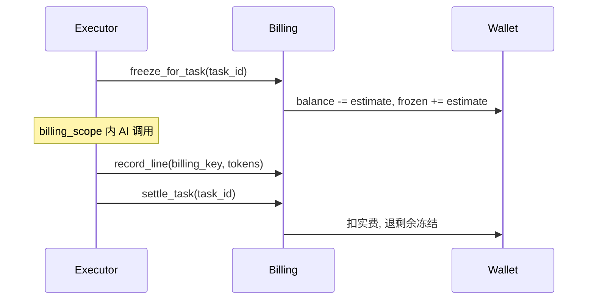

# PRINTFILM 计费说明

## 原则

- 按 **provider_rates 价目表**（各 provider 官方美元价，管理端可改）计算上游成本；无法拿到 usage 时用保守估价。
- 用户支付价 = 上游成本，**不再加价**。
- 钱包内部单位：**分（fen，1/100 CNY）**，仅作记账基准；**任何界面不展示人民币**。
- 展示货币：默认 **VND**，可切 **USD**（见下文「展示货币层」）。
- 充值：**银行转账 + 管理员确认到账**，无第三方支付网关（见下文「银行转账充值」）。
- **所有 AI 调用**均关联 `task_run_id`（单次聊天/API/工具调用创建轻量 TaskRun）。

## 公式

**有上游成本时（优先）**：

```
charge_fen = cost_fen
```

**按 token 估价时**：

```
charge_fen = ceil(tokens / 1e6 * provider_yuan_per_m * 100)
```

默认成本价（元/百万 tokens，可环境覆盖）：

| billing_key | 成本 |
|-------------|------|
| seedance2:video0 | 46 |
| seedance2:video1 | 28 |
| llm_chat | 5 |
| seedream | 8（按次折合约；有上游费用则优先） |
| tts | 2（按次估价） |

### provider_rates（按模型的美元价目）

存于 `app_settings.config_json["provider_rates"]`，首次启动自动写入默认表；可通过后端管理 API `GET/PUT /api/admin/settings/billing/model-rates` 修改（管理端编辑界面随管理端更新（Plan C）提供）。每行 `{pattern, unit, usd, usd_out?, note}`，`pattern` 为模型 id 的 glob（不区分大小写），**自上而下第一条匹配生效**（如 `dreamina-seedance-2-0-fast*` 必须在 `dreamina-seedance-2-0*` 之前）。

| unit | 成本（USD） |
|---|---|
| `per_image` | `usage.generated_images`（缺省 1）× usd |
| `per_m_tokens` | `usage.total_tokens / 1e6 × usd` |
| `per_m_output_tokens` | `usage.output_tokens / 1e6 × usd` |
| `per_m_input_output` | `in / 1e6 × usd + out / 1e6 × usd_out`（只有总 token 时按 70/30 拆） |
| `per_m_chars` | `字符数 / 1e6 × usd` |

```
cost_fen = ceil(usd × BILLING_USD_CNY × 100)   # usd > 0 时至少 1 分
charge_fen = cost_fen
```

结算顺序（`pricing.charge_fen_for_usage`）：① usage 已带 `cost_fen`（adapter 按 provider_rates 用真实 usage 算好）→ 直接用；② 先按调用方（建任务时）的模型匹配 provider_rates，匹配不到再退到 `raw_usage.model`（上游回传的模型）（`first_priced_model`，与下文「模型顺序」一致）；③ 都不匹配 → 上表「按 token 估价」（`BILLING_*_PER_M`，元/百万 token）。生图不会记 0：按 token 计价的图像模型无 usage 时按 6 240 输出 token 封顶估（`EST_IMAGE_OUTPUT_TOKENS`，来源 gpt-image 质量 high、1536×1024 的 OpenAI 图像 token 表：platform.openai.com/docs/guides/image-generation#calculating-costs，2026-09-22 查阅；未验证是否适用于 gpt-image-2/2.5），未匹配的图像模型按 `BILLING_EST_SEEDREAM_TOKENS`。已**移除** New API quota（500000 = 1 USD）、火山人民币 `cost`、Kie credits 解析。

`usd = 0` 的价目行不会让对应模型免费：`rate_cost_usd` 本身只按价目返回 `0.0`，是它的调用方把 `usd <= 0` 当作「没算出成本」并继续走上表的 token 兜底价——`provider_rates.provider_cost_fen` 返回 `None`，`pricing.charge_fen_for_usage` 跳过该结果后按 token 计价。要免费只能把该模型从价目表移除并接受 token 兜底价，或改动这两个调用方让它们接住显式 0。

空价目表（`items: []`）是合法状态：所有模型都落到 token 兜底价，绝不会因为表空而按 0 结算。

预扣（`estimates.py` + `rate_quotes.py`）：按任务对应的**功能**（`kepu.image`、`drama.video`、`tools.image`…）取 slot/override 中仍有效的模型，**取其中最贵者**：

- 图片：每张价，**不乘** `BILLING_ESTIMATE_BUFFER`（清晰度不影响 Seedream 按张价）。
- 视频：`ceil(max(秒,2) × 宽 × 高 × 24 / 1024)` token × 每百万价 × 缓冲；480p=864×480、720p=1280×720、1080p=1920×1080；漫剧缺省 720p。视频 token 公式来自 BytePlus Seedance 计费文档（暂未核实具体链接）。
- LLM / TTS：`BILLING_EST_LLM_TOKENS` / `BILLING_EST_TTS_TOKENS` × 模型价 × 缓冲；对应 usage 行（估算）的 `model` 记为同一最贵模型，保证预扣与结算口径一致。

模型顺序：结算按「建任务时的模型」优先匹配价目，匹配不到再退到上游回传（echo）的模型（`provider_rates.first_priced_model`）。0 张图片的生成结果按 0 fen 结算（upstream 明确报告 `generated_images: 0` 时不再套用估价）。LLM 的真实用量通过 `services/billing/context.py` 的 ContextVar（`billing_scope`）逐次调用记录并累加计价；某次调用没有上游 usage 时，按该次调用的单次估算价格计入（模型取该次调用真实路由到的模型，不是槽位最贵模型的兜底）。

结算金额可能超过预扣（`freeze_for_task` 的估算额）：常见于失败重试后的补记、或把一个 seed 阶段的多次调用并入下一条 usage 行。超出部分由 `settlement.py::settle_task` 的溢出分支直接从余额扣除，**没有上限**（这是既有行为，非本次新增）。

配音（TTS）的用量行模型标签目前取的是槽位随机挑选的结果，不是 `TtsService` 实际调用成功的那个模型/供应商（`voice_synthesis.py`）——标签可能与实际调用的供应商不一致；金额仍按估算封顶，不会因此多扣钱，但账目上的模型名可能有误。

管理端返回 `unpriced_models`：已分配（provider 已启用且有 key）但没有任何价目行匹配的模型（如自定义 `ep-…` 接入点），这些模型会按 token 兜底价结算，请补价目行。BytePlus Seed Speech（`volc_tts`）目前没有默认价目行，会一直出现在这份列表里，直到有人为它补一条价——这是有意保留的提醒，不做隐藏。

## TaskRun 计费流程

每个 `TaskRun` 独立走「预扣 → 记录用量 → 结算」：



### 关键字段

**`usage_events`**（用量行）：

| 字段 | 说明 |
|------|------|
| `task_run_id` | 关联 `task_runs.id`（历史数据可空） |
| `domain` | `kepu` / `drama` / `studio` / `api` |
| `capability` | `llm` / `image` / `video` / `tts` |
| `estimated` | 无上游 usage 时为 `true` |
| `settled` | 任务结算后标记 |

**`task_runs`**（计费快照）：

| 字段 | 说明 |
|------|------|
| `billing_estimate_fen` | 预扣估算额 |
| `billing_charged_fen` | 结算实扣额 |
| `billing_refunded_fen` | 结算退回额 |
| `billing_status` | `none`（未预扣）/ `frozen` / `settled` / `skipped`（预扣时跳过，结算后变 `settled`） |

**`wallet_ledger`**：`ref_type=task_run`、`ref_id={task_id}` 记录 freeze / unfreeze / settle。

### 模块入口

| 场景 | 计费方式 |
|------|----------|
| 科普 pipeline / 单镜重生 | 任务平台 executor 自动 freeze/settle |
| 漫剧剧本/分镜/资产（异步） | `create_task` 入队，handler 内 `record_line` |
| 漫剧聊天 / Skill 优化 / 音色描述 | `run_billed_ephemeral`（见下表） |
| 科普选题扩写 | `run_billed_ephemeral(domain=kepu, content_expand)` |
| 漫剧资产 seed（轻量同步） | `run_billed_ephemeral(domain=drama, seed_assets)` |
| 工作室工具 | `run_billed_ephemeral(domain=studio, tool_image/tool_video)` |
| 开放 API | `run_billed_ephemeral(domain=api, v1_image/v1_video/v1_seedance)` |

### LLM 操作全清单（`billing_key=llm_chat`）

| 用户功能 | domain | task_type | 模式 |
|----------|--------|-----------|------|
| 科普选题扩写 | `kepu` | `content_expand` | 同步 ephemeral |
| 科普分镜编剧 | `kepu` | `project_pipeline`（script 阶段） | 异步任务 |
| 漫剧助手聊天 | `drama` | `agent_chat` | 同步 ephemeral |
| Skill 优化提示词 | `drama` | `skill_optimize` | 同步 ephemeral |
| 角色音色描述 | `drama` | `voice_prompt` | 同步 ephemeral |
| 剧本摘要 | `drama` | `script_summary` | 异步任务 |
| 分集大纲 + 分集正文 | `drama` | `episode_script` | 异步任务（大纲与每集各记 llm_chat） |
| AI 分镜 | `drama` | `fragment_plan` | 异步任务 |
| 资产抽取 / 刷新提示词 | `drama` | `seed_assets` | 异步或同步 ephemeral |
| 资产生图前视觉提示词 LLM | `drama` | `asset_image` / `fragment_video` 等 | 嵌套于父任务 billing_scope |

嵌套 LLM（如 `visual_prompt`）在父任务 `billing_scope` 内通过 `record_llm_chat_line` 追加用量行；无 scope 时由 seed 等路径聚合计费，避免重复。

**不计 LLM 的场景**：分镜规则回退（`rules_fallback`）、分集大纲已就绪跳过大纲 LLM、Skill 优化未勾选任何 Skill。

科普分阶段：`project_pipeline` 的 `script` / `assets` / `videos` 各对应一次 TaskRun，各自独立预扣与结算（旧 payload `produce` 兼容映射为当前下一段）。成片走 `project_compose_only`（几乎不预扣）。阶段判定与 pipeline 共用 `kepu_stages`（含整片旁白文件就绪）。

`awaiting_poll` 分镜视频：executor 提前返回时不结算；轮询完成标 `succeeded` 时 `settle_task`。

余额不足：`freeze_for_task` 失败 → HTTP 402（`create_task` 入队前同步预检，或轻量任务预扣失败）。

全局关闭计费（`BILLING_ENABLED=false`）：预扣时 `billing_status=skipped`（不冻钱包）；`settle_task` 后标 `settled`，usage 行 `settled=true`（仅统计，不扣钱包）。

余额不足失败：`billing_status` 保持 `none`（未成功预扣，勿与全局关闭计费的 `skipped` 混淆）。

api/studio 轻量视频：`awaiting_poll` 由 Selector 后台轮询；超过 `ark_video_poll_timeout` 自动失败并解冻。

## 环境变量

密钥与收款信息勿提交仓库（建议在管理端填写，存 `app_settings`）：

```
BILLING_ENABLED=true
BILLING_MARKUP=1.0
BILLING_DISPLAY_CURRENCY=VND
BILLING_CNY_VND=3600
BILLING_USD_CNY=7.0
TOPUP_BANK_NAME=Vietcombank
TOPUP_BANK_ACCOUNT=0011002233
TOPUP_BANK_HOLDER=NGUYEN VAN A
TOPUP_BANK_BIN=970436
TOPUP_ORDER_EXPIRE_HOURS=24
```

## API

| 方法 | 路径 | 说明 |
|------|------|------|
| GET | `/api/billing/usage/summary` | 本月 token / 费用 / 余额 |
| GET | `/api/billing/orders` | 充值订单列表 |
| GET | `/api/billing/currency` | 展示货币与每分折算系数（公开） |
| GET | `/api/billing/skus` | VND 充值包、是否开放充值 |
| POST | `/api/billing/orders` | `{sku_id}` → 银行转账指引（收款信息 / 备注 / VietQR） |
| GET | `/api/billing/orders/{no}` | 订单状态（前端轮询） |
| POST | `/api/admin/orders/{no}/confirm` | 管理员确认到账并入账（幂等） |
| POST | `/api/admin/orders/{no}/close` | 管理员关闭待支付单 |
| GET | `/api/admin/usage-events` | 管理端用量明细分页 |
| GET | `/api/admin/tasks/{id}` | 任务详情含 `usage_lines` 与计费字段 |
| GET | `/api/admin/settings/billing/model-rates` | provider_rates 价目表（含默认表、单位、未定价模型、USD→CNY 汇率） |
| PUT | `/api/admin/settings/billing/model-rates` | 整表替换 `{items:[…]}`；校验失败 400（越南语提示） |
| GET | `/api/admin/finance/daily` | 按日扣费 / 成本 / 利润（成本 = 本地 `cost_fen`） |

已移除「官方用量对照」相关接口（`/api/admin/stats/upstream-usage`、`.../sync`、`/api/admin/settings/tokenfree/quota`）：不再有可对照的上游账单来源，本地 `cost_fen` 就是唯一的成本口径。`models.py` 里的 `upstream_usage_daily` 表仍在（未删列，符合"不加 Alembic 迁移"的约束），但已无代码写入或读取；`GET /api/admin/finance/daily` 的 `actual_cost_fen` 字段恒等于 `cost_fen`，只是保留字段名兼容前端，管理端应把它们当同一列展示。

## 管理端

- **设置 → 支付与汇率**：银行转账收款信息、展示货币与汇率；按上游成本 1:1 扣费。
- **provider_rates 价目表**：后端 API `GET/PUT /api/admin/settings/billing/model-rates` 已上线；管理端的编辑界面随管理端更新（Plan C）提供，在此之前只能通过 API 修改。
- **订单** → 待支付单可「确认到账」（入账）或「关闭」。
- **订单与流水** → 「用量明细」Tab：按用户/任务/领域筛选 `usage_events`。
- **任务队列** → 列表「费用」列显示 `billing_charged_fen`（冻结中显示预扣）。
- **任务详情** → 「计费」Tab：预扣/实扣/退回 + 用量行列表。

## 验收清单

1. 科普：确认分镜只冻出图+配音；继续生成视频另冻视频段；合成走 compose。各阶段任务结束按实际用量结算。
2. 漫剧分镜视频/资产生成：有 `task_run_id` 的用量行，任务结束扣费。
3. 漫剧聊天 / 选题扩写 / Skill 优化 / 音色描述 / 开放 API / 工作室工具：响应含 `task_id`（轻量 TaskRun），余额变化正确。
4. 管理端可按 `task_run_id` 或 `billing_key=llm_chat` 查到每条 LLM/图/视频/TTS 费用。
5. Seedance 视频成功后 `usage_events.estimated=false` 且 `total_tokens` 与官方任务查询一致。
6. 管理端修改 provider_rates 后，新任务预扣与结算按新价计算；未定价模型出现在 unpriced_models。
7. 生图 / 视频结算金额 = provider_rates 按真实 usage 计算（Seedream 按张、Seedance 按 total_tokens、gpt-image 按输出 token）。
8. 定价页建单 → 管理端确认到账 → 余额按 `credit_fen` 增加；切换 VND / USD 全站金额一致且无 `¥`。

## 展示货币层

内部记账不变，展示时按汇率折算（`services/billing/money.py`）：

| 配置 | 默认 | 说明 |
|------|------|------|
| `BILLING_DISPLAY_CURRENCY` | `VND` | 默认展示货币（VND / USD），管理端「支付与汇率」可改 |
| `BILLING_CNY_VND` | `3600` | 1 CNY 折 VND |
| `BILLING_USD_CNY` | `7.0` | 1 USD 折 CNY（同时用于 provider_rates 美元价折算） |

- `GET /api/billing/currency` 返回 `{ default, options, per_fen }`，`per_fen[c]` 为 1 分折合货币 c 的数值；用户端 `lib/money.ts`、管理端 `lib/currency.ts` 据此格式化（VND 取整 `1.000.000 ₫`，USD `$12.34`），用户选择存 localStorage。
- 后端对用户的提示（余额不足、消费提醒、官方价目标签）统一经 `format_money(fen)` 按默认展示货币输出。
- API 中的 `*_yuan` 字段仅为兼容保留，前端不再使用。

## 银行转账充值

充值包以 VND 定义（`services/billing/pricing.py`）：100k / 500k / 1M（+5%）/ 2M（+10%）。下单时按 `BILLING_CNY_VND` 换算成分并**快照**到订单（`orders.pay_amount / pay_currency`），之后汇率变动不影响已建订单。

```
用户选包 → POST /api/billing/orders {sku_id}
  → pending 单 + 收款信息（银行 / 账号 / 户名 / 转账备注 = 订单号 / VietQR 图）
用户转账（备注写订单号）→ 前端每 10s 轮询 GET /api/billing/orders/{no}
管理端「订单」→ 「确认到账」 POST /api/admin/orders/{no}/confirm {note?}
  → 行锁 + 幂等，credit_topup 入账，status=paid，trade_no=admin:{id}
「关闭订单」 POST /api/admin/orders/{no}/close
待支付单超过 TOPUP_ORDER_EXPIRE_HOURS（默认 24h）自动关闭
```

收款信息在管理端「系统设置 → 支付与汇率」填写（`TOPUP_BANK_NAME / ACCOUNT / HOLDER / BIN`）；账号与户名未填写时 `GET /api/billing/skus` 返回 `topup_enabled=false`，定价页提示充值暂未开放。BIN 用于生成 VietQR 图片（`https://img.vietqr.io/image/{bin}-{account}-compact2.png`）。

历史 `alipay` / `wxpay` 订单只读保留；易支付回调、`EPAY_*` 配置与 nginx `/epay/notify` 反代均已移除。
