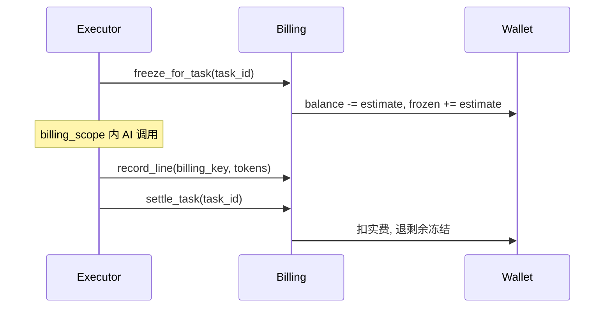

# PRINTFILM 计费说明

## 原则

- 按上游 **真实 TokenFree 成本**（或无法拿到 usage 时的保守估价）计费。
- 用户支付价 = TokenFree 官方成本，**不再加价**。
- 钱包内部单位：**分（fen，1/100 CNY）**，仅作记账基准；**任何界面不展示人民币**。
- 展示货币：默认 **VND**，可切 **USD**（见下文「展示货币层」）。
- 充值：**银行转账 + 管理员确认到账**，无第三方支付网关（见下文「银行转账充值」）。
- **所有 AI 调用**均关联 `task_run_id`（单次聊天/API/工具调用创建轻量 TaskRun）。

## 公式

**有上游成本时（优先）**：

```
charge_fen = cost_fen
```

**按 token 估价时**：

```
charge_fen = ceil(tokens / 1e6 * provider_yuan_per_m * 100)
```

默认成本价（元/百万 tokens，可环境覆盖）：

| billing_key | 成本 |
|-------------|------|
| seedance2:video0 | 46 |
| seedance2:video1 | 28 |
| llm_chat | 5 |
| seedream | 8（按次折合约；有上游费用则优先） |
| tts | 2（按次估价） |

### TokenFree / New API（quota 计费）

上游统一走 TokenFree。单次调用若返回 `usage.quota` / `quota_consumed`，按 New API 额度折人民币：

```
cost_fen = ceil(quota / 500000 × BILLING_USD_CNY × 100)   # 500000 quota = 1 USD
charge_fen = cost_fen
```

未返回 quota 时回退 token 单价。管理端「支付与计费」可「查询 TokenFree 余额」（`GET /v1/dashboard/billing/subscription` + `usage`），并拉取公开价目 `GET https://www.tokenfree.com/api/pricing` 展示推荐模型官方价。

预扣：生图 API 走 TokenFree 实测可通的 `gpt-image-2-5`（分组里没有 `gpt-image-2-5-sunburst`）。计费按 Kie 积分档（1K 6 积分 / 2K 10 积分 / 4K 16 积分；默认 3.5 分/积分 → 2K 35 分，对应 $0.03 / $0.05 / $0.08）。Seedream 会改走 `gpt-image-2-5`，**不要**用 OpenAI $0.625 目录价。**按张官价不再乘 `billing_estimate_buffer`（默认 1.2）**。LLM / 视频 / TTS 估价仍乘缓冲。结算优先单次 `quota` 或 Kie credits；无用量时同样按张档位价，**不再**用 8 元/百万 token。LLM 按官方 in/out（默认 kimi-k2.6，70/30 拆）。视频不用价目表占位 `model_ratio=37.5`，按火山 480P 秒价 × 清晰度倍率（720P×2 / 1080P×4）；漫剧缺省按 720P。勿把 New API 的美元 `cost` 当人民币。

管理端「官方用量对照」复用模型页 TokenFree API Key，拉取 New API 日消耗（`/api/data/self` 或 billing usage，日期无效时按累计额度差分记到当天）并与本地成本对照。

## TaskRun 计费流程

每个 `TaskRun` 独立走「预扣 → 记录用量 → 结算」：



### 关键字段

**`usage_events`**（用量行）：

| 字段 | 说明 |
|------|------|
| `task_run_id` | 关联 `task_runs.id`（历史数据可空） |
| `domain` | `kepu` / `drama` / `studio` / `api` |
| `capability` | `llm` / `image` / `video` / `tts` |
| `estimated` | 无上游 usage 时为 `true` |
| `settled` | 任务结算后标记 |

**`task_runs`**（计费快照）：

| 字段 | 说明 |
|------|------|
| `billing_estimate_fen` | 预扣估算额 |
| `billing_charged_fen` | 结算实扣额 |
| `billing_refunded_fen` | 结算退回额 |
| `billing_status` | `none`（未预扣）/ `frozen` / `settled` / `skipped`（预扣时跳过，结算后变 `settled`） |

**`wallet_ledger`**：`ref_type=task_run`、`ref_id={task_id}` 记录 freeze / unfreeze / settle。

### 模块入口

| 场景 | 计费方式 |
|------|----------|
| 科普 pipeline / 单镜重生 | 任务平台 executor 自动 freeze/settle |
| 漫剧剧本/分镜/资产（异步） | `create_task` 入队，handler 内 `record_line` |
| 漫剧聊天 / Skill 优化 / 音色描述 | `run_billed_ephemeral`（见下表） |
| 科普选题扩写 | `run_billed_ephemeral(domain=kepu, content_expand)` |
| 漫剧资产 seed（轻量同步） | `run_billed_ephemeral(domain=drama, seed_assets)` |
| 工作室工具 | `run_billed_ephemeral(domain=studio, tool_image/tool_video)` |
| 开放 API | `run_billed_ephemeral(domain=api, v1_image/v1_video/v1_seedance)` |

### LLM 操作全清单（`billing_key=llm_chat`）

| 用户功能 | domain | task_type | 模式 |
|----------|--------|-----------|------|
| 科普选题扩写 | `kepu` | `content_expand` | 同步 ephemeral |
| 科普分镜编剧 | `kepu` | `project_pipeline`（script 阶段） | 异步任务 |
| 漫剧助手聊天 | `drama` | `agent_chat` | 同步 ephemeral |
| Skill 优化提示词 | `drama` | `skill_optimize` | 同步 ephemeral |
| 角色音色描述 | `drama` | `voice_prompt` | 同步 ephemeral |
| 剧本摘要 | `drama` | `script_summary` | 异步任务 |
| 分集大纲 + 分集正文 | `drama` | `episode_script` | 异步任务（大纲与每集各记 llm_chat） |
| AI 分镜 | `drama` | `fragment_plan` | 异步任务 |
| 资产抽取 / 刷新提示词 | `drama` | `seed_assets` | 异步或同步 ephemeral |
| 资产生图前视觉提示词 LLM | `drama` | `asset_image` / `fragment_video` 等 | 嵌套于父任务 billing_scope |

嵌套 LLM（如 `visual_prompt`）在父任务 `billing_scope` 内通过 `record_llm_chat_line` 追加用量行；无 scope 时由 seed 等路径聚合计费，避免重复。

**不计 LLM 的场景**：分镜规则回退（`rules_fallback`）、分集大纲已就绪跳过大纲 LLM、Skill 优化未勾选任何 Skill。

科普分阶段：`project_pipeline` 的 `script` / `assets` / `videos` 各对应一次 TaskRun，各自独立预扣与结算（旧 payload `produce` 兼容映射为当前下一段）。成片走 `project_compose_only`（几乎不预扣）。阶段判定与 pipeline 共用 `kepu_stages`（含整片旁白文件就绪）。

`awaiting_poll` 分镜视频：executor 提前返回时不结算；轮询完成标 `succeeded` 时 `settle_task`。

余额不足：`freeze_for_task` 失败 → HTTP 402（`create_task` 入队前同步预检，或轻量任务预扣失败）。

全局关闭计费（`BILLING_ENABLED=false`）：预扣时 `billing_status=skipped`（不冻钱包）；`settle_task` 后标 `settled`，usage 行 `settled=true`（仅统计，不扣钱包）。

余额不足失败：`billing_status` 保持 `none`（未成功预扣，勿与全局关闭计费的 `skipped` 混淆）。

api/studio 轻量视频：`awaiting_poll` 由 Selector 后台轮询；超过 `ark_video_poll_timeout` 自动失败并解冻。

## 环境变量

密钥与收款信息勿提交仓库（建议在管理端填写，存 `app_settings`）：

```
BILLING_ENABLED=true
BILLING_MARKUP=1.0
BILLING_KIE_FEN_PER_CREDIT=3.5
BILLING_DISPLAY_CURRENCY=VND
BILLING_CNY_VND=3600
BILLING_USD_CNY=7.0
TOPUP_BANK_NAME=Vietcombank
TOPUP_BANK_ACCOUNT=0011002233
TOPUP_BANK_HOLDER=NGUYEN VAN A
TOPUP_BANK_BIN=970436
TOPUP_ORDER_EXPIRE_HOURS=24
```

## API

| 方法 | 路径 | 说明 |
|------|------|------|
| GET | `/api/billing/usage/summary` | 本月 token / 费用 / 余额 |
| GET | `/api/billing/orders` | 充值订单列表 |
| GET | `/api/billing/currency` | 展示货币与每分折算系数（公开） |
| GET | `/api/billing/skus` | VND 充值包、是否开放充值 |
| POST | `/api/billing/orders` | `{sku_id}` → 银行转账指引（收款信息 / 备注 / VietQR） |
| GET | `/api/billing/orders/{no}` | 订单状态（前端轮询） |
| POST | `/api/admin/orders/{no}/confirm` | 管理员确认到账并入账（幂等） |
| POST | `/api/admin/orders/{no}/close` | 管理员关闭待支付单 |
| GET | `/api/admin/usage-events` | 管理端用量明细分页 |
| GET | `/api/admin/tasks/{id}` | 任务详情含 `usage_lines` 与计费字段 |
| GET | `/api/admin/stats/upstream-usage` | 近 N 日官方/本地成本对照 |
| POST | `/api/admin/stats/upstream-usage/sync` | 手动刷新官方用量快照 |
| GET | `/api/admin/settings/billing/model-rates` | 推荐模型 TokenFree 官方价（/api/pricing） |
| GET | `/api/admin/settings/tokenfree/quota` | 查询 TokenFree 账户剩余额度 |

## 管理端

- **设置 → 支付与汇率**：银行转账收款信息、展示货币与汇率；按 TokenFree 官方成本 1:1 扣费；可查看模型费率表与查询 TokenFree 余额。
- **订单** → 待支付单可「确认到账」（入账）或「关闭」。
- **订单与流水** → 「用量明细」Tab：按用户/任务/领域筛选 `usage_events`。
- **任务队列** → 列表「费用」列显示 `billing_charged_fen`（冻结中显示预扣）。
- **任务详情** → 「计费」Tab：预扣/实扣/退回 + 用量行列表。
- **仪表盘** → 「TokenFree 官方用量对照」：本地成本 vs New API 用量（需在「模型」填写 TokenFree API Key）。

## 验收清单

1. 科普：确认分镜只冻出图+配音；继续生成视频另冻视频段；合成走 compose。各阶段任务结束按实际用量结算。
2. 漫剧分镜视频/资产生成：有 `task_run_id` 的用量行，任务结束扣费。
3. 漫剧聊天 / 选题扩写 / Skill 优化 / 音色描述 / 开放 API / 工作室工具：响应含 `task_id`（轻量 TaskRun），余额变化正确。
4. 管理端可按 `task_run_id` 或 `billing_key=llm_chat` 查到每条 LLM/图/视频/TTS 费用。
5. Seedance 视频成功后 `usage_events.estimated=false` 且 `total_tokens` 与官方任务查询一致。
6. 配置 TokenFree API Key 后，管理端可刷新并查看近 30 日官方/本地成本对照。
7. 单次调用若带 New API `quota` / `quota_consumed`，按额度折算后按官方成本 1:1 扣费；管理端可查询 TokenFree 余额。
8. 定价页建单 → 管理端确认到账 → 余额按 `credit_fen` 增加；切换 VND / USD 全站金额一致且无 `¥`。

## 展示货币层

内部记账不变，展示时按汇率折算（`services/billing/money.py`）：

| 配置 | 默认 | 说明 |
|------|------|------|
| `BILLING_DISPLAY_CURRENCY` | `VND` | 默认展示货币（VND / USD），管理端「支付与汇率」可改 |
| `BILLING_CNY_VND` | `3600` | 1 CNY 折 VND |
| `BILLING_USD_CNY` | `7.0` | 1 USD 折 CNY（同时用于 TokenFree quota 折算） |

- `GET /api/billing/currency` 返回 `{ default, options, per_fen }`，`per_fen[c]` 为 1 分折合货币 c 的数值；用户端 `lib/money.ts`、管理端 `lib/currency.ts` 据此格式化（VND 取整 `1.000.000 ₫`，USD `$12.34`），用户选择存 localStorage。
- 后端对用户的提示（余额不足、消费提醒、官方价目标签）统一经 `format_money(fen)` 按默认展示货币输出。
- API 中的 `*_yuan` 字段仅为兼容保留，前端不再使用。

## 银行转账充值

充值包以 VND 定义（`services/billing/pricing.py`）：100k / 500k / 1M（+5%）/ 2M（+10%）。下单时按 `BILLING_CNY_VND` 换算成分并**快照**到订单（`orders.pay_amount / pay_currency`），之后汇率变动不影响已建订单。

```
用户选包 → POST /api/billing/orders {sku_id}
  → pending 单 + 收款信息（银行 / 账号 / 户名 / 转账备注 = 订单号 / VietQR 图）
用户转账（备注写订单号）→ 前端每 10s 轮询 GET /api/billing/orders/{no}
管理端「订单」→ 「确认到账」 POST /api/admin/orders/{no}/confirm {note?}
  → 行锁 + 幂等，credit_topup 入账，status=paid，trade_no=admin:{id}
「关闭订单」 POST /api/admin/orders/{no}/close
待支付单超过 TOPUP_ORDER_EXPIRE_HOURS（默认 24h）自动关闭
```

收款信息在管理端「系统设置 → 支付与汇率」填写（`TOPUP_BANK_NAME / ACCOUNT / HOLDER / BIN`）；账号与户名未填写时 `GET /api/billing/skus` 返回 `topup_enabled=false`，定价页提示充值暂未开放。BIN 用于生成 VietQR 图片（`https://img.vietqr.io/image/{bin}-{account}-compact2.png`）。

历史 `alipay` / `wxpay` 订单只读保留；易支付回调、`EPAY_*` 配置与 nginx `/epay/notify` 反代均已移除。
