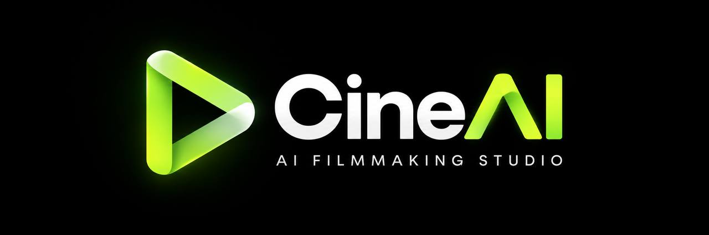

# CineAI — Định hướng thương hiệu

> Bản nháp v0.1 (2026-09-21), dựng từ `logo-concept.jpg` bằng skill `brandkit`. Màu HEX là giá trị đề xuất, cần chốt lại khi có file logo vector.



## 1. Chiến lược

| Mục | Nội dung |
|---|---|
| Danh mục | Studio làm phim bằng AI: video khoa học ngắn và phim truyện tranh (drama) theo template |
| Người dùng | Creator, kênh nội dung, studio nhỏ tại Việt Nam |
| Lời hứa | Từ ý tưởng đến thước phim hoàn chỉnh, không cần đoàn phim |
| Cá tính | Điện ảnh · chính xác · nhanh · sáng tạo nhưng có kiểm soát |
| Ẩn dụ cốt lõi | **Một dải liên tục** — mọi khung hình nối thành một mạch kể |
| Tránh | Robot, não bộ, tia sét, glow tím–xanh "AI chung chung", neon rẻ tiền |

## 2. Đọc logo concept

**Biểu tượng:** nút Play được gấp từ **một dải băng duy nhất** (3 nếp gấp).
- Play = xem phim, sản phẩm đầu ra.
- Một dải không đứt = tính liên tục giữa các cảnh (đúng với cơ chế nối khung đầu/cuối của pipeline), và cũng gợi cuộn phim.

**Wordmark:** `Cine` trắng + `AI` xanh lime, chữ **A bỏ gạch ngang (Λ)** lặp lại đỉnh tam giác của biểu tượng. Đây là chi tiết hay, nên giữ.

**Descriptor:** `AI FILMMAKING STUDIO`, chữ in hoa, giãn chữ rộng.

**Cần chỉnh để dùng được thực tế:**
1. **Bỏ glow và gradient 3D ở phiên bản chính.** Hiệu ứng phát sáng chỉ dùng cho ảnh hero/marketing. Logo chuẩn phải là màu phẳng, 2 tông lime (mặt trước sáng, nếp gấp tối) để còn rõ ở 16px.
2. **Phiên bản 1 màu** (trắng / đen / lime) cho favicon, watermark trên video, in ấn.
3. **Kiểm tra `Λ` ở cỡ nhỏ**: dưới ~20px có thể đọc thành "CineΛI". Ở cỡ nhỏ chỉ dùng biểu tượng, không dùng wordmark.
4. Vector hoá lại theo lưới 60° để 3 nếp gấp đều nhau.

## 3. Màu sắc (đề xuất)

| Token | HEX | Vai trò |
|---|---|---|
| `lime-400` | `#C4F53A` | Màu nhận diện chính — CTA, trạng thái active, chữ `AI` |
| `lime-600` | `#7CC61E` | Mặt gấp của logo, hover, viền nhấn |
| `ink-950` | `#0A0B0A` | Nền chính (tối, hơi ấm, không phải đen tuyền xanh) |
| `ink-900` | `#141614` | Panel, card |
| `ink-700` | `#2A2E2A` | Viền, đường chia |
| `bone-50` | `#F2F4EE` | Chữ chính trên nền tối |
| `ash-400` | `#8A9088` | Chữ phụ, nhãn |
| `amber-400` | `#FFB547` | *Phụ, dùng rất ít* — ánh đèn tungsten, cảnh báo |

Quy tắc: lime chỉ chiếm ~5–10% bề mặt. Một màu nhấn gánh toàn bộ hệ thống; không thêm màu nhấn thứ ba.

## 4. Chữ

- **Be Vietnam Pro** — font chính (UI + tiêu đề). Hình học, gần với wordmark, hỗ trợ dấu tiếng Việt đầy đủ.
- **JetBrains Mono** — timecode, thông số kỹ thuật, nhãn nhỏ (`00:00:12:04`, `16:9`, `1080p`).
- Descriptor/nhãn in hoa: letter-spacing 0.2–0.3em.

## 5. Tagline

- Descriptor cố định: **AI FILMMAKING STUDIO**
- Tagline đề xuất: **"Từ ý tưởng đến thước phim."** / EN: **"From idea to final cut."**
- Phương án khác: "Mỗi khung hình, một mạch kể." / "Every frame, one story."

## 6. Prompt tạo bảng brand kit

Dùng với model ảnh có hỗ trợ ảnh tham chiếu (đính kèm `logo-concept.jpg`). Chữ trong ảnh giữ tiếng Anh vì model ảnh thường vẽ sai dấu tiếng Việt.

```text
Create a premium brand-kit overview image for "CineAI", an AI filmmaking studio.
Use the attached logo as the exact reference for the mark and wordmark — keep its shape, do not redesign it.

Brand strategy:
- category: AI filmmaking platform — short science explainer videos and comic-style drama series, built from templates
- audience: independent creators and small content studios in Vietnam
- personality: cinematic, precise, fast, creative but controlled
- core metaphor: one continuous ribbon — every frame folds into a single unbroken story
- logo idea: a play triangle folded from a single lime ribbon (three folds, one continuous strip); the crossbar-less "A" in the wordmark echoes the triangle's apex

Layout:
3×3 grid, 16:10, on a near-black charcoal presentation canvas with strong even gutters, clean alignment, generous negative space, small page numbers (01–09) and tiny footer labels.

Panels:
1. Logo cover — flat version of the CineAI mark + wordmark, large, centered, black background, no glow, descriptor "AI FILMMAKING STUDIO" below in widely tracked caps.
2. Logo construction — the play triangle on a 60° isometric grid, thin lime construction lines showing it is made of one ribbon with three folds, clear-space box around it.
3. Digital application — minimal dark app window: top bar with the mark, one prompt input reading "A 60-second film about black holes", one lime "Generate" button. Nothing else.
4. Brand essence — tagline "From idea to final cut." in large white type, the word "final cut" in lime, lots of empty space.
5. Color system — five vertical swatches: lime #C4F53A (largest), deep lime #7CC61E, ink #0A0B0A, graphite #141614, bone white #F2F4EE; one tiny amber #FFB547 chip.
6. Typography — large "Aa" specimen in a clean geometric sans (Be Vietnam Pro style) plus a line of monospace timecode "00:00:12:04".
7. Physical application — a matte black film clapperboard with the flat lime ribbon mark and "CineAI" printed on it, soft studio light.
8. Image direction — cinematic film still: dark empty film set at dusk, a single lime-green practical light, subtle film grain, anamorphic feel, no people facing camera.
9. System detail — a horizontal storyboard strip of five small frames connected by one continuous lime ribbon line, with small chips beneath: "Script", "Storyboard", "Video", "Voice", "Final cut".

Visual mode:
dark cinematic builder — near-black panels, one lime accent, subtle film grain, thin rules, restrained.

Palette:
near-black #0A0B0A, graphite #141614, bone white #F2F4EE, lime #C4F53A, deep lime #7CC61E; amber #FFB547 only as a tiny accent.

Style:
premium, sparse, cinematic, intentional, polished brand-guidelines deck, no clutter, no neon glow except subtle on the cover, no robots, no brains, no purple-blue AI gradients, no copied real-world logos.

Typography:
readable, minimal, strong hierarchy, no tiny fake paragraphs, no lorem ipsum.

Logo:
identical CineAI mark repeated consistently across panels 1, 2, 3, 7 — flat two-tone lime, same proportions every time.
```

**Biến thể nhanh (2×3, gọn hơn):** giữ panel 1, 3, 8, 2, 4 và 9 theo thứ tự đó.

## 7. Đã áp vào code (2026-09-21)

Chốt **phương án 2** của bảng brand kit (`boards/`, không commit).

- **Logo phẳng:** `logo.svg` (ô nền tối, dùng cho favicon/app icon/nav) và `logo-mark.svg` (chỉ biểu tượng, dùng trên nền tối), sinh bằng `gen_logo.py`. Đã chép sang `frontend/public/{logo,favicon}.svg`, `frontend/public/logo.png`, `admin/public/{logo,favicon}.svg`.
- **Wordmark:** `Cine` + `AI` (component `BrandMark`). Trên nền sáng, `AI` dùng `--pf-lime-ink` (#4A7A0C) để đủ tương phản; trên nền tối dùng lime `#C4F53A`.
- **Token frontend** (`frontend/src/index.css`): `--pf-lime #C4F53A`, `--pf-lime-deep #7CC61E`, `--pf-lime-ink #4A7A0C`, `--pf-ink #0A0B0A`, `--pf-font-sans`, `--pf-font-display`. Lime cũ `#B6FF00` đã thay toàn bộ.
- **Font:** Be Vietnam Pro thay Space Grotesk (frontend) và Anybody/Figtree (admin).
- **Tên và domain:** chữ hiển thị PRINTFILM → CineAI, `printfilm.com` → `cineai.vn`, email `support@cineai.vn`. Backend thêm `cineai.vn` vào allowlist CORS/URL tĩnh, giữ domain cũ.
- **Giữ nguyên có chủ đích:** class `pf-*`, file `printfilm.css`, khoá localStorage `printfilm.*`, tên DB/volume Docker, dòng copyright trong `LICENSE`.

## 8. Còn lại

- Giao diện vẫn nền sáng; nền tối có thể làm ở lượt sau.
- Admin vẫn giữ màu xanh rừng (forest) cũ, chỉ đổi logo, tên và font.
- Chưa có file vector chính thức do designer vẽ; `gen_logo.py` là bản dựng hình học tạm.
- JetBrains Mono cho timecode chưa được nạp.
